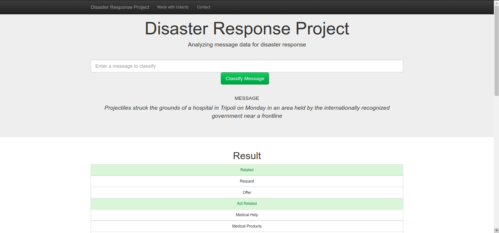

# Disaster-Response-Pipeline

## Table of Contents

- [Motivation](#motivation)
- [Files](#files)
- [Requirements](#requirements)
- [Instructions](#instructions)
- [Author](#author)

## Motivation <a name="motivation"></a>
This project focuses on analyzing disaster data from [Figure Eight](https://www.figure-eight.com/) to build a model that is  used to be included in a web-app which allows entering a new message and obtaining the predictions regarding disaster related categories.

## Files <a name="files"></a>
```
- app
| - template
| |- master.html  # main page of web app
| |- go.html  # classification result page of web app
|- run.py  # main Flask file that runs app

- data
|- disaster_categories.csv  # data to process 
|- disaster_messages.csv  # data to process
|- messages.csv # processed messages
|- DisasterResponse.db   # database to save clean data to

- models
|- train_classifier.py
|- model.pkl  # saved model

- requirements
|- requirements.txt #can be easy to install using pip install requirements
```
## Requirements <a name="requirements"></a>
You can find all required libraries that used in this project in ```requirements.txt``` .

## Instructions <a name="instructions"></a>
1. Run the following commands in the project's root directory to set up your database and model.

    - To run ETL pipeline that cleans data and stores in database
        `python data/process_data.py data/disaster_messages.csv data/disaster_categories.csv data/DisasterResponse.db`
    - To run ML pipeline that trains classifier and saves
        `python models/train_classifier.py data/DisasterResponse.db models/classifier.pkl`

2. Run the following command in the app's directory to run your web app.
    `python run.py`

3. Go to http://0.0.0.0:3001/

4. The Main page will render


5. Here is example for classifying a message using this app and the result is below


## Author <a name="author"></a>
Mahmoud Ahmed
- [Github](https://devmahmoud10.github.io/portfolio/)
- [Linkedin](https://www.linkedin.com/in/devmahmoud10/)
